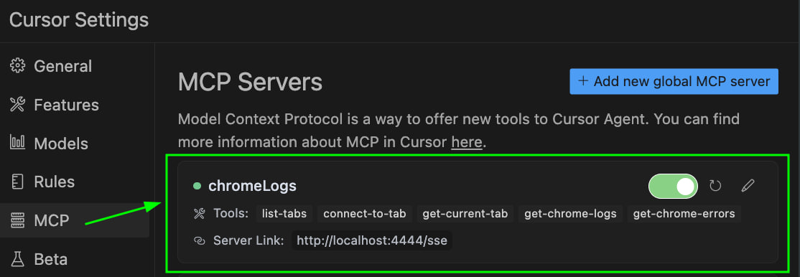
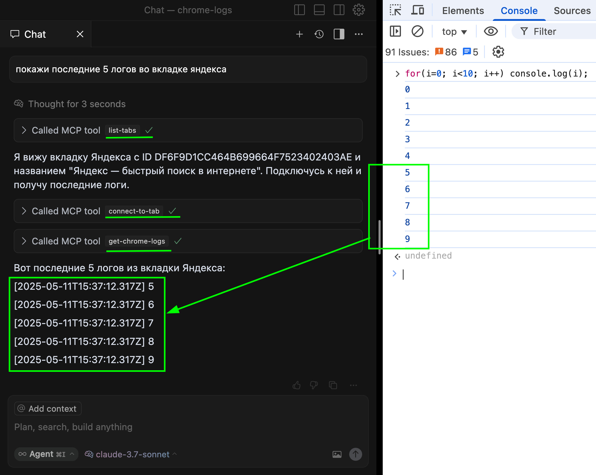

# Chrome Logs MCP Server

MCP сервер для сбора логов и ошибок из Chrome.
К mcp серверу можно подключаться любым MCP клиентом,
поддерживающим SSE (однопоточные серверные стрим события)

## 1. Установка

```bash
pnpm install
```

## 2. Запуск Chrome с удаленной отладкой

```bash
# Для macOS
/Applications/Google\ Chrome.app/Contents/MacOS/Google\ Chrome \
  --remote-debugging-port=9222 \
  --user-data-dir=/tmp/chrome-debug-profile \
  --no-first-run \
  http://localhost:3000 # тут url приложения

# Для Linux
google-chrome \
  --remote-debugging-port=9222 \
  --user-data-dir=/tmp/chrome-debug-profile \
  --no-first-run \
  http://localhost:3000 # тут url приложения
```

## 3. Сборка и запуск сервера

Для разработки:
```bash
PORT=4444 pnpm dev --title=sendio
```

Для продакшена:
```bash
pnpm run build
pnpm start
```

## 4. Настройка MCP Server для Cursor

```json
{
  "mcpServers": {
    "chromeLogs": {
      "enabled": true,
      "url": "http://localhost:4444/sse",
      "type": "sse",
      "cache": {
        "enabled": false
      }
    }
  }
}
```



## 5. Пример использования


